## Project 3. Two Phase Commit Protocol Multi-server Key-Value Store using Java RMI

### Description

This application is an implementation of distributed key-value store. To maintain the consistency
among multiple key-value store servers, we have a coordinator that helps implement Two-Phase Commit
Protocol. For my understanding, I have named coordinator as Leader and key-value stores/servers as
Followers. When a `PUT` or `DELETE` operation is requested, leader sends a `prepare` message to the
followers, if followers respond with positive acknowledgement, then leader issues commit on all the
followers or else aborts from all the follower servers. Programmatically, prepare message
corresponds to follower allowing to lock the server for upcoming write requests. If all servers gets
successfully locked, then leader will send commit and since, server is already locked, it can
perform write operation and accordingly unlock the server. On the other hand, if all servers are not
able to provide the lock to leader then abort the operation on all servers which will simply not
perform the operation and release any locks if it had acquired.

### Steps to run the Java RMI program demo:

1. Unzip the source folder named TwoPhaseCommitRMI.zip and go inside it
2. Open Terminal/Bash shell
3. Execute `sh run_rmi.sh`, this will compile all classes, put it in a folder, compile stub through
   rmic then start the rmiregistry server
   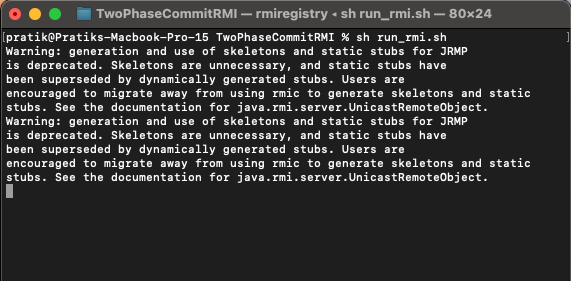
4. Step 3 compiles all java files and puts them into a directory called classes. Now you can go
   inside this classes folder and Open 5 or more new Terminal/Bash shell here (1 for coordinator, 2
   for server and 2+ for clients)
5. Execute `cd classes/`
6. Run the Coordinator first by executing `java LeaderApp <leader-port-number>`
6. Run the Server by executing `java FollowerApp <coordinator-port> <server-port>`
7. Run the Clients on multiple bash shells for client by executing `java Client <server-port>"`
   Now, Client, Server, and RMI Server all are up and should look like this
   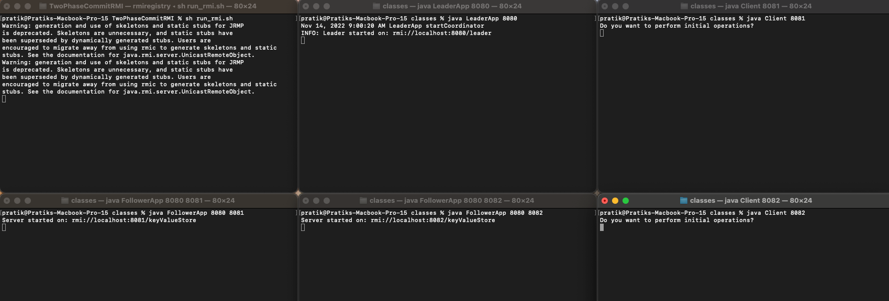
8. Client can now request for inputs which it will use to call server to perform get, put, delete
   operations on the key-value store, change the server it is connected to
9. Can input `exit` to stop the client:
   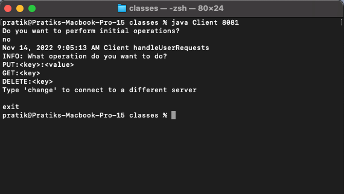
10. Server and rmiregistry server will stay alive forever unless interrupted with
    Ctrl+c.  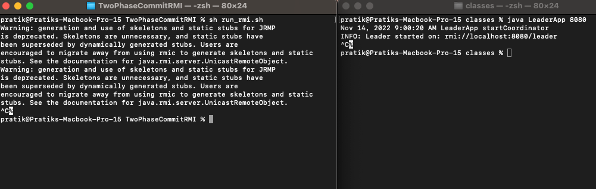

### Operations supported:

- All the values for `key` and `value` are inputted as String in the
  application [Note these string values must not contain a `:`]
- PUT operation used to insert new key-value pair onto the server -
  PUT:`<key>`:`<value>` [Note : Application uses colon ':' only as delimiter, anything else will be treated as invalid input]
- GET operation used to fetch the value for the key given from the server - GET:`<key>`
- DELETE operation used to delete the key-value pair for the key given from the server -
  DELETE:`<key>`
- `exit` to stop the client:
  
- Server will accept an input where `key` or/and `value` are not blank, and if blank then client
  responds as malformed!
  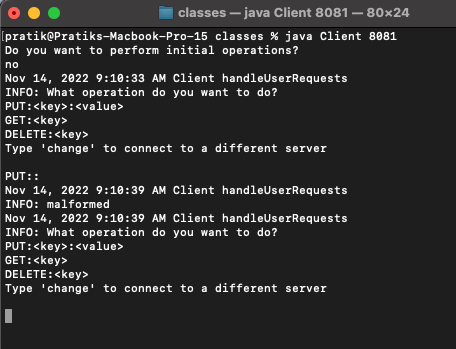
- Name of the operation needs to be in upper/lowercase as `PUT`, `GET`, `DELETE` followed by
  colon `:` and key and if value required.
- For `PUT`, `key` and `value` both are expected to be provided delimited by `:` else client will
  reject the request as malformed!
  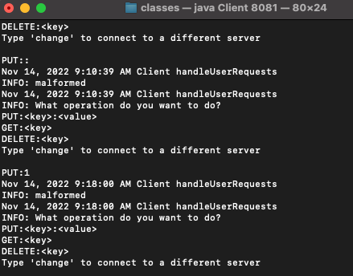
- For `PUT`, if valid key-value pair provided then leader polls all the servers if they can do the
  operation, if they acknowledge then all the servers perform operations and respond as below  
  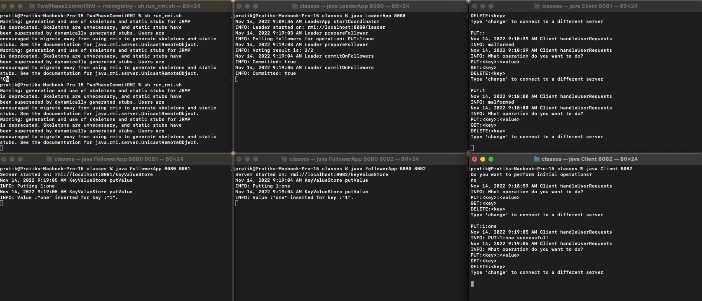
- For `GET` , `key` is expected to be provided delimited by `:` else client will reject the request
  as malformed!  
  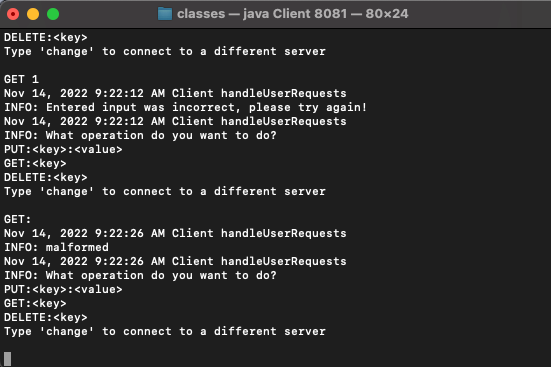
- For `GET`, if value is present and any client asks for the value for the key then server responds
  as below   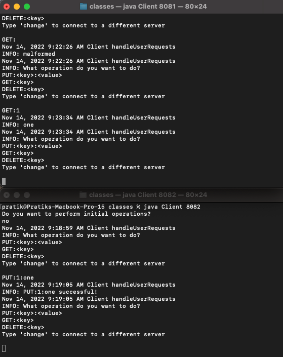
- For `GET`, if value not present for requested key then server responds as
    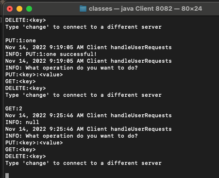
- For `DELETE` , `key` is expected to be provided delimited by `:` else server will reject the
  request as malformed!  
  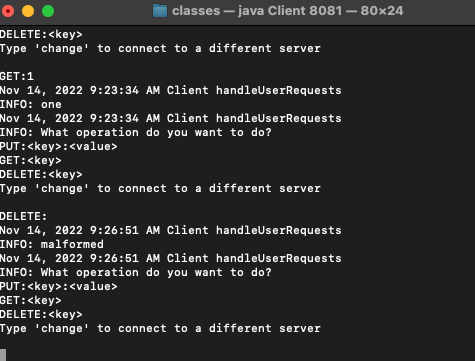
- For `DELETE` , if key is present then leader polls all the servers if they can perform this
  operation, if all of ths servers respond yes then deletes the value on all servers and responds as
  
- Multiple clients can ask to perform different operations on any key-value store server and all
  key-value
  stores reflect changes from all clients  
  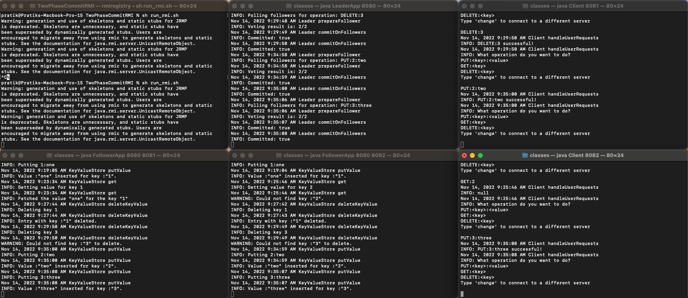
- For demo purposes a file named `input.txt` is added in the `resources` directory which will be
  used to demo at least 5 PUT, 5 GET and 5 DELETE operations and prepopulate key-value stores with 5
  key-value pairs, this is asked to client when it starts, if it needs to be performed then
  type `yes`
  else `no`   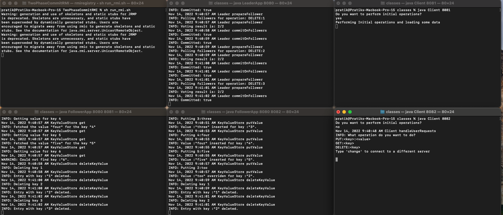
- Client can request to connect to another server in run-time such that all of its requests will now
  redirect to new key-value store which can be showed from get operations as
  below:   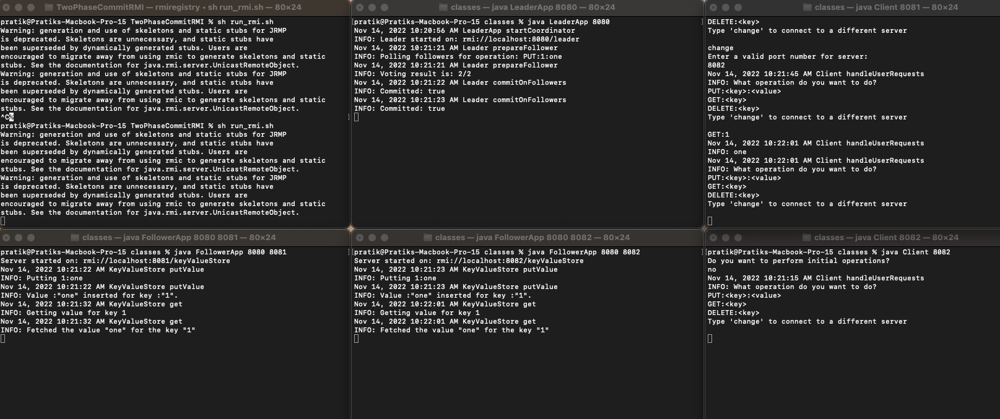
- As this distributed system implements two phase commit protocol for `PUT` and `DELETE` operations,
  leader sends a prepare request to all the servers on these operations, if all servers are able to
  provide their access to the coordinator at that time then only coordinator sends a commit request
  to all servers or else sends abort to abort the operation and release the access.
- Abort happens when one write operation is happening and another request comes in between, then
  coordinator does not get all votes from servers to perform the operation hence resulting in failed
  operation as below:   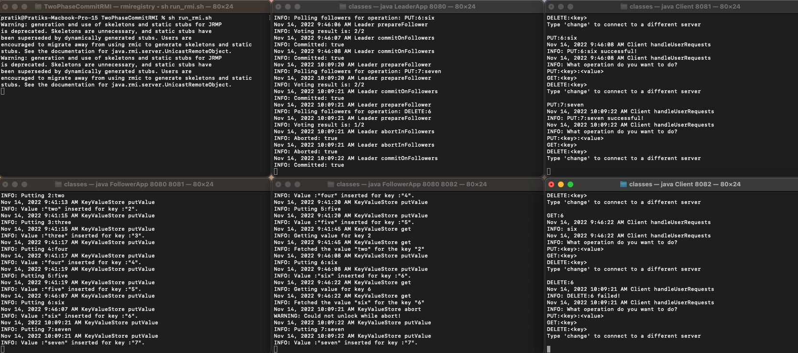
